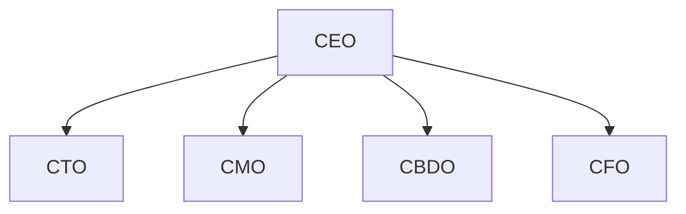

# LearnXR executive team in Paperclip

This document describes the **LearnXR** C-suite in [Paperclip](https://github.com/paperclipai/paperclip): roles, reporting lines, **cursor** adapter parity with the CEO, prerequisites, and how to create agents. It assumes you use a Paperclip build that includes the LearnXR onboarding bundles (`cto`, `cmo`, `cbdo`, `cfo`) and the `cbdo` role enum.

## Prerequisites

1. **Cursor Agent CLI** installed and authenticated; **Paperclip** server running with instance `.env` including `PAPERCLIP_AGENT_JWT_SECRET` so runs receive `PAPERCLIP_API_KEY`. See [PAPERCLIP_CEO_BRIDGE.md](./PAPERCLIP_CEO_BRIDGE.md).
2. **CEO agent** already exists (`role: ceo`, `reportsTo: null`, `adapterType: cursor`). Copy the CEO’s **agent id** from the UI or API for `reportsTo` below.

## Org chart (all report to CEO)



| Seat | Paperclip `role` | Example `title` | Focus |
|------|------------------|-----------------|--------|
| Chief Executive | `ceo` | CEO | Strategy, hiring, company-wide (existing agent) |
| Technology | `cto` | CTO | Platform, security, engineering quality, XR/labs tech |
| Marketing | `cmo` | CMO | Brand, demand, school-facing campaigns |
| Business development | `cbdo` | CBDO | CBSE/school pipeline, partnerships, pilots |
| Finance | `cfo` | CFO | Unit economics, budgets, pricing guardrails |

**Phase 2 (optional):** Heads of product (`pm`), curriculum (`researcher` or `general` + title), customer success (`general` + title), and ICs (`engineer`, `designer`, `qa`) — usually `reportsTo` **CTO** or **PM**, not all to CEO.

## Cursor adapter parity

For each executive, mirror the CEO’s setup:

- **`adapterType`:** `cursor`
- **`adapterConfig`:** Same pattern as CEO (default model is applied if omitted — see Paperclip `applyCreateDefaultsByAdapterType`). Use per-agent `instructionsFilePath` only if you override the managed bundle.
- **Skills:** Assign the same company-library skills as the CEO where appropriate (e.g. `para-memory-files`, `paperclip`), via UI or API when creating or editing the agent.
- **Heartbeats:** Enable on each agent that should run on a schedule.

New agents with `role` in `ceo | cto | cmo | cbdo | cfo` receive the **four-file** managed bundle (`AGENTS.md`, `HEARTBEAT.md`, `SOUL.md`, `TOOLS.md`) from Paperclip onboarding assets — LearnXR-specific copy is embedded for `cto`, `cmo`, `cbdo`, and `cfo`.

## Creating agents (board UI)

1. Open your company → **Agents** → **New agent**.
2. For each executive: set **name**, **role** (`cto` / `cmo` / `cbdo` / `cfo`) — use the **Role** field, not only the display name. If role is left as **`general`**, Paperclip stores wrong `role` (org tree and onboarding bundles will not match). **Reports to** = CEO, **adapter** = **Cursor (local)**.
3. Save. If **board approval for new agents** is enabled, approve the hire.
4. Assign **skills** and enable **heartbeat** to match CEO.
5. Trigger a first run; confirm run log shows injected auth (redacted) and the agent can complete `GET /api/agents/me` per `HEARTBEAT.md`.

## Creating agents via API (optional)

Use a **board** session (browser cookie or bearer) — agents cannot call `POST /companies/:companyId/agents` as non-board.

Replace `COMPANY_ID`, `CEO_AGENT_UUID`, and your session auth.

**CTO example:**

```http
POST /api/companies/COMPANY_ID/agents
Content-Type: application/json

{
  "name": "CTO",
  "role": "cto",
  "title": "Chief Technology Officer",
  "reportsTo": "CEO_AGENT_UUID",
  "adapterType": "cursor",
  "adapterConfig": {}
}
```

Repeat with `"role": "cmo"`, `"cbdo"`, `"cfo"` and appropriate `name` / `title`.

**CEO-driven hires:** The CEO agent (JWT on run) may use `POST /api/companies/COMPANY_ID/agent-hires` with the same body shape if your instance allows agent-initiated hires and approvals.

## After board approval (wire executives to CEO)

Approving a hire sets the new agent to **`idle`** but does **not** automatically set **`reportsTo`**, **skill sync**, or **heartbeat** if those were missing at hire time. To match the CEO operationally and fix the org tree, run the align script or perform the equivalent API calls.

### Align script (recommended)

From the LearnXR website repo root:

```bash
node scripts/paperclip/align-learnxr-c-suite.mjs
```

**Environment variables**

| Variable | Required | Description |
|----------|----------|-------------|
| `PAPERCLIP_COMPANY_ID` | Yes | Company UUID (from Paperclip UI URL or `GET /api/companies`). |
| `PAPERCLIP_COOKIE` | Only off-loopback | For **`local_trusted`** Paperclip on **localhost** (`127.0.0.1` / `localhost`), the API treats requests as implicit board — **no cookie needed**. For **authenticated** / remote hosts, paste the full `Cookie` header from DevTools → Network → a `GET /api/...` request. |
| `PAPERCLIP_BASE_URL` | No | Default `http://127.0.0.1:3100`. |
| `PAPERCLIP_CEO_AGENT_ID` | No | If omitted, the script requires exactly one non-terminated agent with `role: ceo`. |
| `PAPERCLIP_AUTH_HEADER` | No | Optional `Authorization` value (e.g. `Bearer ...`) for authenticated deployments instead of or in addition to cookie. |
| `PAPERCLIP_DRY_RUN` | No | Set to `1` or `true` to print planned changes without calling `PATCH`/`POST`. |
| `PAPERCLIP_RESUME_CEO` | No | Default resumes a **paused** CEO via `POST /api/agents/:ceoId/resume` before aligning reports. Set to `0` or `false` to skip. |

The script, for each **idle** agent that is a LearnXR executive: Paperclip **`role`** `cto` / `cmo` / `cbdo` / `cfo`, **or** (if role was mistakenly `general`) **`urlKey`** or **name** matching `cto`, `cmo`, `cbdo`, `cfo` (case-insensitive):

1. Optionally `PATCH` **`role`** to the canonical value (`cto`, etc.).
2. `PATCH` **`reportsTo`** = CEO id.
3. `GET /api/agents/:ceoId/skills` → `POST /api/agents/:id/skills/sync` with the CEO’s `desiredSkills` (skips if CEO has no desired skills; configure CEO in the UI first).
4. `PATCH` **`runtimeConfig`** (merged), copying the CEO’s **`heartbeat`** block; if the CEO’s heartbeat interval is `0`, uses a safe default (`enabled: true`, `intervalSec: 3600`, etc.).

**PowerShell (local Paperclip, no cookie)**

```powershell
$env:PAPERCLIP_COMPANY_ID = "YOUR_COMPANY_UUID"
node scripts/paperclip/align-learnxr-c-suite.mjs
```

**PowerShell (remote / cookie)**

```powershell
$env:PAPERCLIP_COMPANY_ID = "YOUR_COMPANY_UUID"
$env:PAPERCLIP_COOKIE = "your_cookie_header_value"
node scripts/paperclip/align-learnxr-c-suite.mjs
```

### Manual API sequence (same effect)

With board session auth, for each executive agent id:

1. `PATCH /api/agents/EXEC_ID` — `{ "reportsTo": "CEO_AGENT_UUID" }`
2. `GET /api/agents/CEO_ID/skills` — note `desiredSkills`.
3. `POST /api/agents/EXEC_ID/skills/sync` — `{ "desiredSkills": [ ... ] }`
4. `GET` current agent (or use list response), merge `runtimeConfig` with CEO’s `runtimeConfig.heartbeat`, then `PATCH /api/agents/EXEC_ID` — `{ "runtimeConfig": { ...merged } }`

Then confirm with the [verification checklist](#verification-checklist) and `GET /api/instance/scheduler-heartbeats` (executives should show `schedulerActive: true` when heartbeat is enabled and `intervalSec` is greater than zero).

## OpenClaw mirror C-suite (gateway adapter)

The **Cursor** C-suite (above) is ideal for repo/IDE work. For **OpenClaw-native** execution (gateway WebSocket, WhatsApp and other channels, always-on/async work), Paperclip uses a **parallel** org of agents with adapter **`openclaw_gateway`**.

### Adapter configuration (this Paperclip build)

- **Adapter id:** `openclaw_gateway` (see `GET http://127.0.0.1:3100/llms/agent-configuration.txt` and `/llms/agent-configuration/openclaw_gateway.txt`).
- **Required `adapterConfig`:** `url` (`ws://` or `wss://` to your OpenClaw gateway, e.g. `ws://127.0.0.1:18789`), plus auth via **`authToken`** (matches `gateway.auth.token` in `~/.openclaw/openclaw.json`) or **`headers`** with `x-openclaw-token` / `x-openclaw-auth`.
- **UI caveat:** If the gateway token does not persist on first hire, edit the agent after create or PATCH via API (see [paperclip#744](https://github.com/paperclipai/paperclip/issues/744)).

### Org shape

- **CEO (OpenClaw):** `adapterType: openclaw_gateway`, `role: general`, `title: CEO (OpenClaw)`, `reportsTo: null` (Paperclip allows only one `role: ceo`; the Cursor CEO remains the canonical `ceo` role for governance APIs).
- **Mirrors:** `CTO (OpenClaw)`, `CMO (OpenClaw)`, `CBDO (OpenClaw)`, `CFO (OpenClaw)` — same Paperclip roles as Cursor execs, all `reportsTo` = OpenClaw CEO id.
- **Icons:** Must be from `GET /llms/agent-icons.txt` (e.g. `cpu`, `mail`, `globe`, `target`, `crown`).

### Scripts (repo root)

| Script | Purpose |
|--------|---------|
| [`scripts/paperclip/audit-openclaw-capabilities.mjs`](../../scripts/paperclip/audit-openclaw-capabilities.mjs) | Read-only table: which agents pass **OpenClaw execution** (gateway + auth + heartbeat + skills). |
| [`scripts/paperclip/hire-openclaw-mirror-c-suite.mjs`](../../scripts/paperclip/hire-openclaw-mirror-c-suite.mjs) | Hire mirror execs under CEO (OpenClaw), **approve** pending hires, print **`openclaw/invite-prompt`** `onboardingTextUrl` per mirror (set `PAPERCLIP_SKIP_INVITES=1` to skip URLs). Uses `OPENCLAW_GATEWAY_TOKEN` or reads `~/.openclaw/openclaw.json`. |
| [`scripts/paperclip/align-openclaw-mirror-c-suite.mjs`](../../scripts/paperclip/align-openclaw-mirror-c-suite.mjs) | Sync **OpenClaw CEO** `desiredSkills` + heartbeat to OpenClaw mirror execs (same pattern as `align-learnxr-c-suite.mjs`). |

**npm (from `server/`):** `npm run paperclip:audit-openclaw`, `npm run paperclip:hire-openclaw-mirrors`, `npm run paperclip:align-openclaw-c-suite` (requires `PAPERCLIP_COMPANY_ID`).

### Registering each mirror in OpenClaw

After hires are **approved** and agents are `idle`, run the hire script **without** `PAPERCLIP_SKIP_INVITES`, or call `POST /api/companies/{companyId}/openclaw/invite-prompt` (CEO or board). Fetch each returned **`onboardingTextUrl`** and paste the prompt into OpenClaw so the gateway client joins Paperclip for that agent identity. Keep **`agentDefaultsPayload.url`** aligned with your gateway WebSocket URL.

### Task routing: Cursor vs OpenClaw

Use **labels or projects** so assignments are unambiguous:

| Runtime | Typical tasks |
|---------|----------------|
| **Cursor** agents | Code, refactors, large repo reads, PR-style work |
| **OpenClaw** mirror agents | WhatsApp / chat channels, async comms, lightweight status, anything that does not need the IDE |

Suggested labels: `runtime:cursor`, `runtime:openclaw`, or `channel:whatsapp` for OpenClaw-owned work. Assign the issue to the matching agent (e.g. **CBDO** vs **CBDO (OpenClaw)**).

### Company skill key note

The imported OpenClaw+Paperclip skill key may look like `local/<hash>/openclaw-paperclip`. If you re-import from disk, the hash can change — update `desiredSkills` in scripts or re-run `npm run paperclip:import-openclaw-skill`.

## n8n bridge (LearnXR server)

Workflow keys configured for the LearnXR API bridge live in [server/config/paperclip-n8n-workflows.json](../../server/config/paperclip-n8n-workflows.json). As of this doc:

| `workflowKey` | Typical owner |
|---------------|----------------|
| `learnxr-website-lead` | **CMO** / **CBDO** (lead follow-up, CRM handoff) |
| `ui-pdf-to-vr-lesson` | **CTO** / product (content pipeline, lesson generation) |

Invoke via `POST` to LearnXR `/api/paperclip-n8n/trigger` with `Authorization: Bearer` and body `{ "workflowKey", "correlationId", "payload" }` — see [PAPERCLIP_CEO_BRIDGE.md](./PAPERCLIP_CEO_BRIDGE.md).

## Verification checklist

- [ ] Org chart in Paperclip shows executives under CEO (`reportsTo`).
- [ ] Each executive run completes identity check (`GET /api/agents/me`) with `chainOfCommand` including CEO.
- [ ] Managed instructions under each agent’s `instructions/` folder match the four-file bundle after first materialization.
- [ ] Optional: export org chart SVG from Paperclip (`cbdo` renders as Business Development in supported themes).
- [ ] OpenClaw: `npm run paperclip:audit-openclaw` (from `server/`) shows **PASS** for all `*(OpenClaw)*` agents; each has completed OpenClaw registration via invite `onboardingTextUrl` if you use gateway pairing.

## Paperclip fork changes (reference)

- `packages/shared/src/constants.ts` — `cbdo` in `AGENT_ROLES` and `AGENT_ROLE_LABELS`.
- `server/src/routes/org-chart-svg.ts` — `cbdo` role tag and icon styling.
- `server/src/services/default-agent-instructions.ts` — bundles for `cto`, `cmo`, `cbdo`, `cfo`.
- `server/src/onboarding-assets/{cto,cmo,cbdo,cfo}/` — LearnXR-oriented markdown.

Restart Paperclip after upgrading the server package so new onboarding assets load.
